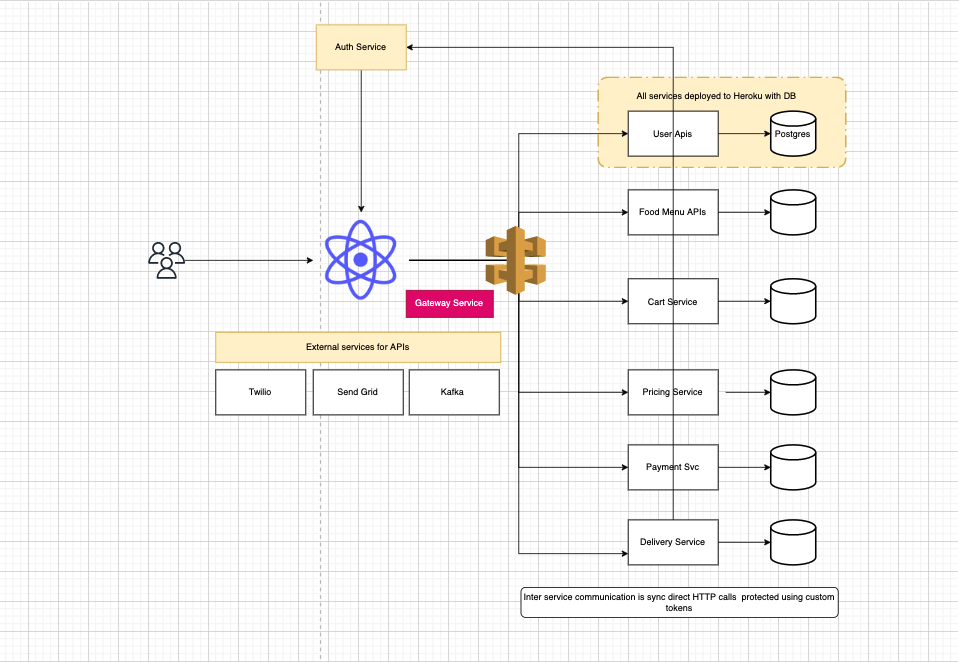
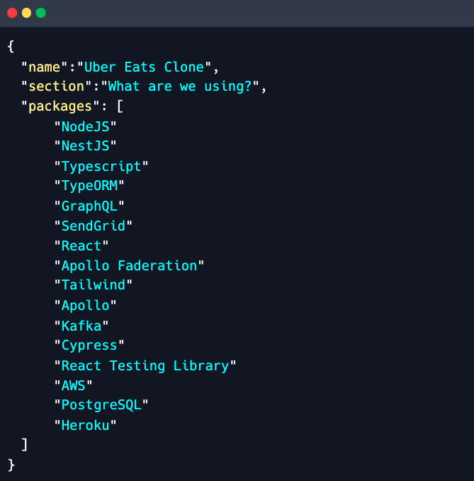
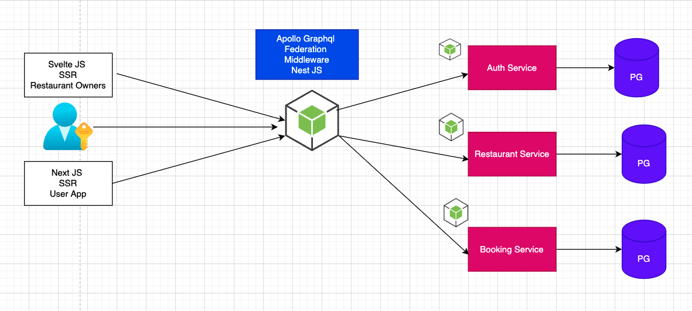

## Uber Eats Clone App

<h1 align="center">
  Uber Eats Clone
  <br>
</h1>

<h4 align="center">Uber eats clone app made for training on Youtube <a href="http://electron.atom.io" target="_blank">Javascript</a>.</h4>

<p align="center">
  <a href="https://www.paypal.me/tkssharma">
    
  </a>
  
</p>

<p align="center">
  <a href="#key-features">Key Features</a> •
  <a href="#how-to-use">How To Use</a> •
  <a href="#download">Download</a> •
  <a href="#credits">Credits</a> •
  <a href="#related">Related</a> •
  <a href="#license">License</a>
</p>

## Key Features

- TBD

## How To Use

To clone and run this application, you'll need [Git](https://git-scm.com) and [Node.js](https://nodejs.org/en/download/) (which comes with [npm](http://npmjs.com)) installed on your computer. From your command line:

```bash
# Clone this repository
$ git clone git@github.com:tkssharma/UberEats-Clone-Full-Stack.git

# Go into the repository
$ cd UberEats-Clone-Full-Stack

# Install dependencies
$ lerna run bootstrap

# Run the app
$ lerna run build
```

Note: If you're using Linux Bash for Windows, [see this guide](https://www.howtogeek.com/261575/how-to-run-graphical-linux-desktop-applications-from-windows-10s-bash-shell/) or use `node` from the command prompt.

### Architecture

We are building different microservices for uber eats clone app.


### Toolings

We will be using all different latest tech stack and all this will also add learning as we will be using Next JS, Svelte Kit and many other things first time on my channel.



### Services

| Service            |   Tools    | Deployment | setup |
| :----------------- | :--------: | ---------: | ----: |
| Auth Service       |   nestjs   |            |       |
| Gateway Service    |   nestjs   |            |       |
| Restaurant Service |   nestjs   |            |       |
| User Portal        |  Next JS   |            |       |
| Restaurant Portal  | Svelte Kit |            |       |

### Database

- ERD per service coming up

### Integration




### Local Setup


### Deployment


### Trouble shooting and Notes
